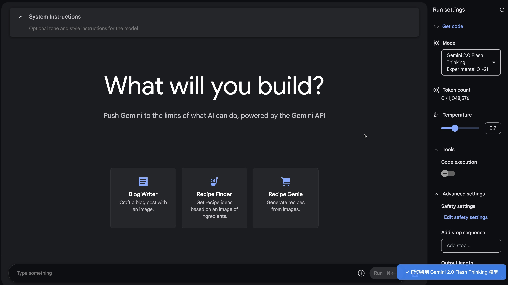

# AI Studio Model Switcher

这是一个 Chrome 插件，用于在打开 Google AI Studio 新对话页面时自动切换到指定的模型。

## 功能

- **自动检测页面加载**：无需手动操作，插件会自动检测新对话页面的加载。
- **自动切换到指定模型**：根据用户的选择或默认设置，自动切换到相应的 Gemini 模型。
- **支持页面动态加载**：即使页面内容动态变化，插件也能正确识别并切换模型。
- **用户可选默认模型**：新增功能，用户可以通过插件的弹出界面选择自己常用的模型作为默认选项。
- **切换通知**: 插件会在页面右下角显示模型切换状态的提示信息。

## 界面展示

插件会在页面右下角显示模型切换状态的提示信息（例如："✓ 已切换到 Gemini 2.0 Flash Thinking Experimental 01-21 模型" 或 "❌ 未找到目标模型"）。

## 安装方法

1.  下载本项目所有文件（或克隆 Git 仓库）。
2.  打开 Chrome 浏览器，进入扩展程序页面（chrome://extensions/）。
3.  开启"开发者模式"。
4.  点击"加载已解压的扩展程序"。
5.  选择本项目所在的文件夹。

## 使用方法

1.  安装插件后，打开 https://aistudio.google.com/prompts/new_chat 。
2.  插件会自动切换到指定的模型。
3.  您可以通过点击浏览器工具栏上的插件图标，打开弹出窗口，选择您喜欢的模型作为默认模型。
4.  您可以在控制台查看切换状态的详细日志信息。

## 注意事项

-   请确保您有访问 Google AI Studio 的权限。
-   如果 Google AI Studio 的页面结构发生重大变化，可能需要更新插件以保持兼容性。
-   如遇到问题，请首先查看浏览器控制台的错误信息，这有助于诊断问题。

## 版本

-   **v1.5**: 增加了用户可选默认模型功能, 优化了模型切换逻辑和通知系统。

## 开源许可

本项目基于 MIT 许可开源，详情请参阅 [LICENSE](LICENSE) 文件。

## 联系方式

-   **X (Twitter)**: [@gm365](https://x.com/gm365)
-   **GitHub**: [gm365/Model-Switcher](https://github.com/gm365/Model-Switcher) 